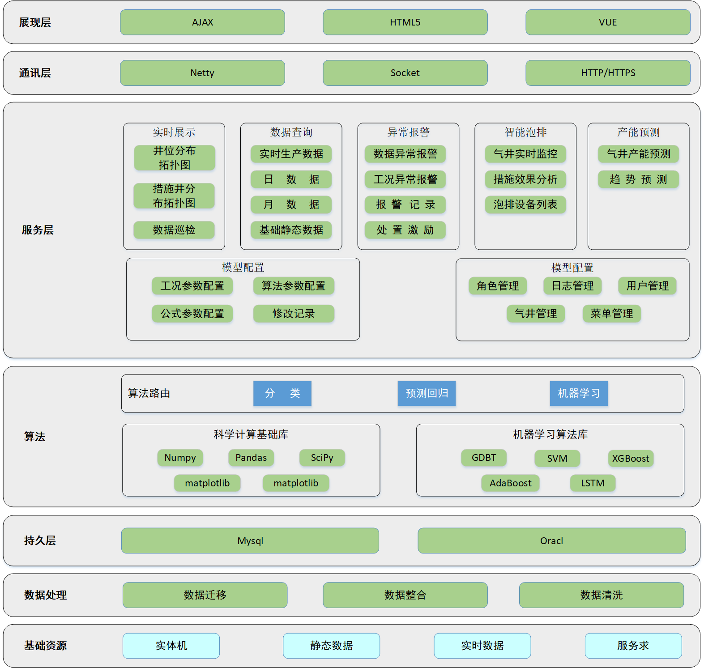

# 1. 平台系统架构

合川气田气井数据管理及设计分析应用平台涉及到数据查询、异常报警、智能泡排、产能预测等功能模块。系统平台架构如图所示。

                    

平台架构包含基础资源，数据处理，算法、持久层、服务层、通讯层以及展现层七部分。数据预处理部分主要涉及数据迁移、合并以及清洗等相关功能模块；应用服务部分主要涉及基础服务模块，包含了可视化工具，第三方框架（如Socket，TensorFlow等）以及后台开发模块、算法调用协议、数据清洗模块以及机器学习/深度学习模块等。基于上述模块功能的开发，最终实现了平台